# Stats_170AB -- Capstone Project

This is my Capstone project. I and my teammate were curious about how differently the Goodreads and Amazon users review a book, so below we  
* Obtained and clean large Amazon and Goodreads datasets.
* Utilized multiprocessing to maximize CPU utilization to drastically speed up the cleaning process by 100 times.
* Utilized EDA to explore the characteristics of the datasets and to choose suitable algorithms for the datasets.
* Utilized Latent Dirichlet allocation (LDA) to improve the accuracy of the predictions.
* Used various statistical tools and machine learning algorithms to predict the rating differences between the Amazon rating and the Goodreads rating given the user reviews of a book.
* Provided insights and conclusions about the datasets from the results of EDA and machine learning models.
* Wrote a report communicating the results to non-technical and technical audiences.  

To get the full project report, please visit [my github](https://github.com/4tiennguyen/Stats_170AB/blob/master/complete_project/Final_Project_Report%20.pdf)   
To get the full codes, please visit [my github](https://github.com/4tiennguyen/Stats_170AB)

------------------------------------------------------------------------------------------------------------------------------------------------------------------------------
# Introduction
Goodreads and Amazon are both well-established sources for book reviews where book lovers can reference and decide whether they should purchase a book. But the problem is Goodreads and Amazon have different user base and star rating interpretations, so which site should a user depend on?
For example, a 3 star rating on Amazon means “it’s okay” whereas a 3 star rating in Goodreads means “liked it.”  The difference in star rating definitions of each site can be seen on the table on the right. We suspect that Amazon might have a lower rating scale because its main interest is to sell books not to provide accurate reviews.
We hypothesize that Amazon’s lower scale would potentially lead to Amazon books having higher ratings than Goodreads.
Therefor,  our goal is to predict the difference in ratings between Goodreads and Amazon so that users can have a better idea of a book’s ratings when comparing it between the two platforms

# Data
There are 4 datasets in our project: 
* Amazon reviews                
* Amazon metadata  
* Goodreads reviews             
* Goodreads metadata  

Both Amazon datasets are provided by UCSD’s associate professor.

Both Goodreads datasets are crawled from Goodreads’ API.  

We collected about **6 millions book reviews** from the two websites **with 37 thousand books**.

#### Data Cleaning  
For both reviews dataset, we perform text cleaning, which consists of ten steps which are :
* filtering out non English reviews
* removing html tags, 
* removing emojis, 
* removing extra white space, 
* converting texts to lowercase, 
* removing numbers, 
* expanding contraction, 
* removing all punctuation, 
* correcting spelling, 
* removing all stopwords 
* lemmatizing  

Apart from model prediction, we also did sentiment analysis. Text cleaning for both sentiment analysis and model prediction are almost identical. While for model prediction, we removed all of the emojis, punctuation and stopwords, for text sentiment analysis, we didn't remove emojis and we only removed some punctuation and some stopwords. We didn’t remove some negation stop words such as the word “not” or ‘nor’. This is because, for sentiment analysis, positive reviews don’t seem to be affected by the above stop words. However, for negative reviews, the whole meaning of a sentence would be changed if we remove negation stop words.  

**Text cleaning**, however, entails a huge overhead. It is slow and highly serial. On our **first experiment**, it took about 20 hrs for only 80 thousand reviews, which means it would **take 62 days, or 9 weeks, to finish all of the reviews.**   
A solution we came up with was to use multiprocessing as following :
* Splitting a big review file into 500 files
* using 10 computers with 20 CPU cores each.  

As a result, we **reduced the text cleaning process to 7hrs for all of the review.**

#### Final Data Description

The Goodreads reviews dataset has 906,876 reviews.
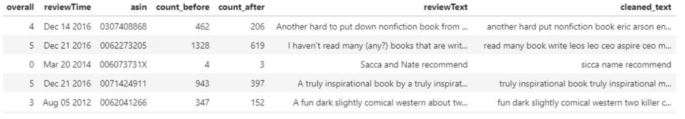

The Goodreads book metadata dataset has 37,233 rows and 21 columns
 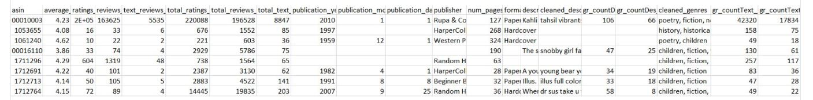

The Amazon reviews dataset has 5,683,680 reviews. Like the Goodreads reviews dataset, Amazon data being saved includes the rating, review time, ASIN/ISBN, word count before cleaning, word count after cleaning, raw review text, and processed review text.  

The dimension of the Amazon metadata dataset is 37233 rows x 10 columns. Each row contains a book found on both Goodreads and Amazon. Numeric features include ratings, ratings count, reviews count, rank, reviews word counts before cleaning, and reviews word counts after cleaning. Categorical features include genres and book format.

# Sentiment Analysis

As we can see from the graphs, the distribution of the sentiment labels are nearly identical. For both Goodreads and Amazon, there are a lot of more positive reviews than negative reviews, and only about 5% of the reviews are neutral for both datasets. However, we detected a few outlier examples of the labels. For example, there are about 5% of the Amazon reviews that are classified as positive reviews have a rating of smaller than 3 out of 5. That of the Goodreads dataset is 10%. 
 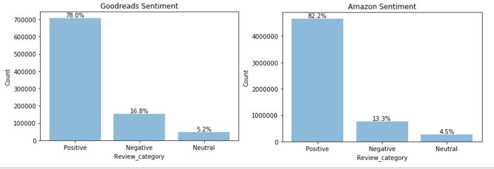

 As we can see, these are the top 50 trigram words in the both dataset. Some trigrams like highly_recommend_book, woud_recommend_book both appear in the two dataset. 
 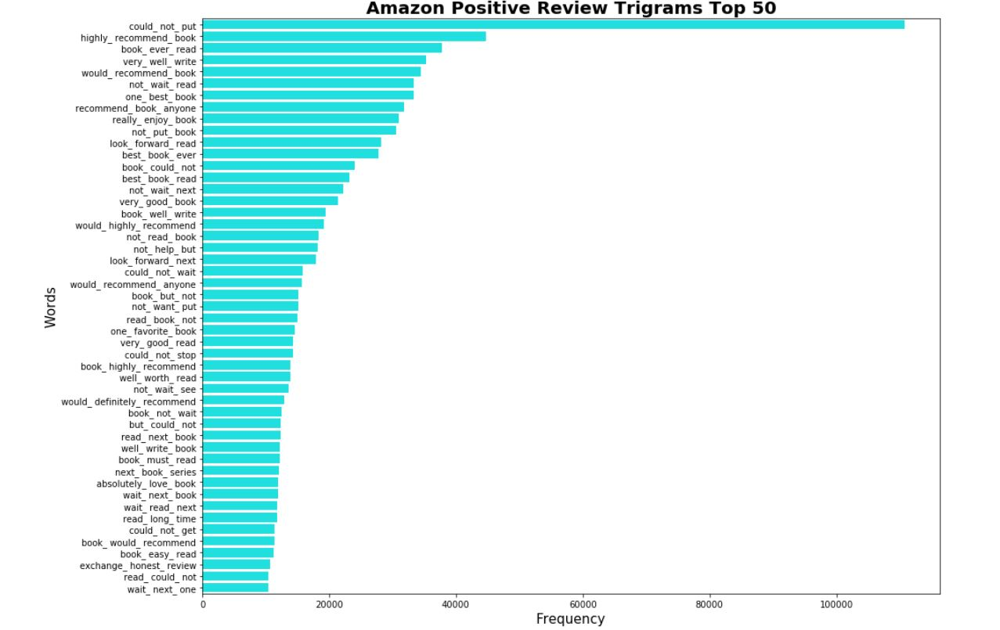 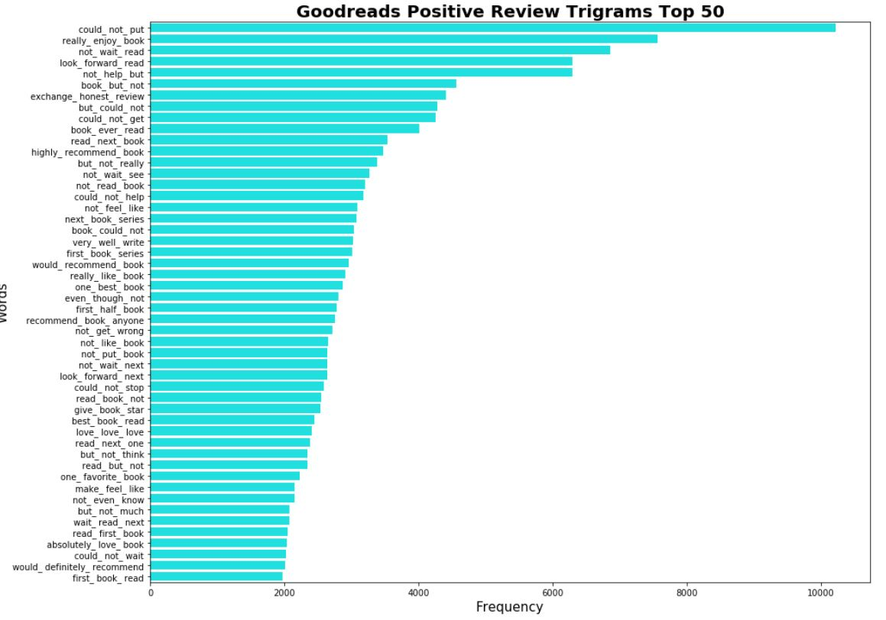

For negative reviews, we see some negative words like would_not_recommend or not_recommended_book. However, we also see some trigram seem to be positive such as recommend_book_anyone or look_forward_word but these are just trigram words, we don’t know if there is a negation word like ‘not’  in front of them.
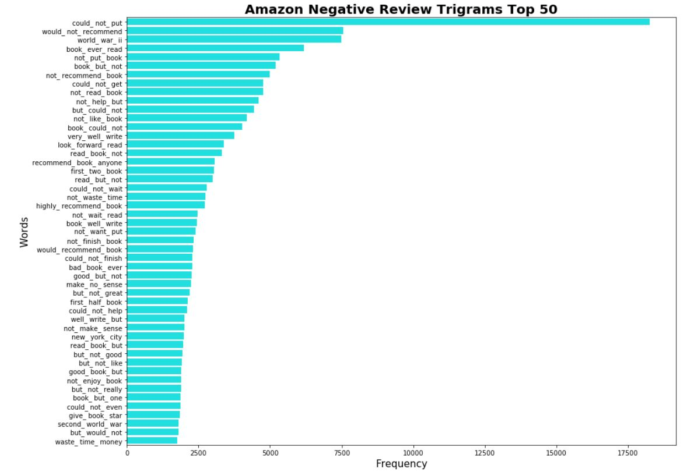 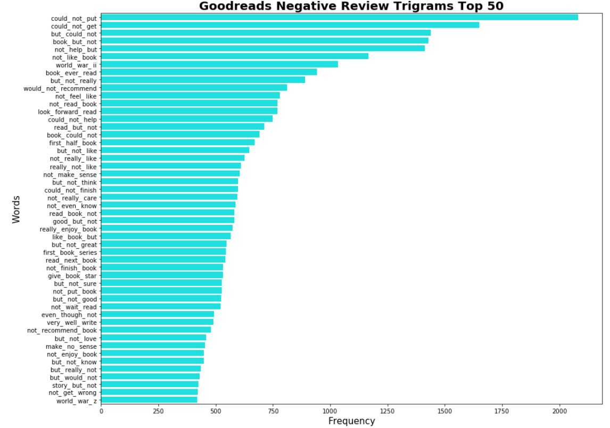

Overall, the graphs make sense, except for a few outliers.
One interesting example is that, for both the top negative and positive trigrams of both datasets, the most common trigram is could_not_put. This is an interesting problem to look at because the phrase “could not put” could be in both positive and negative reviews. A positive example is that “could not put this book away”, and a negative example is that “so terrible that I could not put into words”. Trying to do n-grams for n greater than 3 is computationally challenging given the size of the dataset and computing resource we have. 

# Exploratory data analysis

To find the difference in ratings, we subtracted Goodreads’s average rating from Amazon’s average rating for each book. The average rating difference is around 0.4, meaning on average Amazon’s ratings is approximately half a star more than that of Goodreads. 
 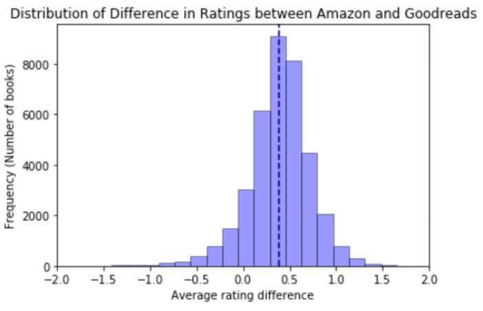

# Data Modeling
We decided to perform feature selection on metadata as raw attributes and on text reviews using Natural Language Processing (NLP) and Latent Dirichlet Allocation (LDA) in order to generate attributes as features for our prediction model.

#### 1. Machine Learning Algorithms
We tried 4 algorithms for our model :
* Multiple regression
* Random Forest
* XGBoost 
* Neural Network  

We evaluated our models with varying metadata attributes using:
* MAE
* MSE
* RMSE
* R2.

#### 2. Natural Language Processing (NLP)
After performing text cleaning, we counted the number of words before and after cleaning text reviews for each book to use them as features in addition to metadata attributes.  
#### 3. Latent Dirichlet Allocation (LDA)

 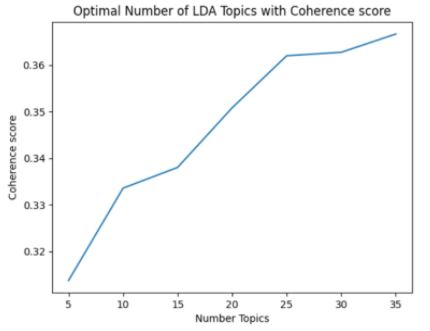

The optimal number of topics is 35, which has the highest score of  0.3667. Like the other tables, the LDA table has the ASIN feature along with 35 proportion topics features ( eg: prop_topic_1, prop_topic_2, etc.). We merged this table with the metadata table through ASIN.

### 4.  Prediction models (without LDA features)

We started by modeling the books metadata and selecting attributes for each of the algorithms. We found that most of the numeric features are good predictors. We had to do some data cleaning such as combining the number of ratings from Goodreads and Amazon into one feature. And likewise for the number of text reviews.  

Since there are null values in the dataset, we tried four methods to deal with them for each of the models and compared the errors for each method in order to find the best way to deal with the missing values. First we omitted training on the null rows. Second, we replaced null values with the mean for each of the features. Third, we replaced null values with the median of each of the features. And lastly, we imputed the missing values. We found that for all methods, omitting the null rows gave us the best results since there weren’t too many null rows in our dataset.  

Regarding the categorical features, we one-hot encoded them and tested them on all the models and compared their train and test performance. genres was the only good one to incorporate into our model since there were too many levels for the other features such as format and publisher. These features created too many dummy variables and noise in the data that the models ended up performing worse.  

After features selection, we tuned hyperparameters using grid search cross validation.

### 5.  Prediction models (with LDA features)

After having LDA features, we combined them with basic features and performed the three algorithms listed in section 4.2. We tested both weighted and unweighted averages of RF, NN, and XGB with cross-validation train/test split to try and improve the model performance beyond just the three individual models. We evaluated the ensembles based on MAE, MSE, RMSE, and R2 adjusted.  

# Experiments and Evaluation 
For **our baseline**, we decided to calculate the errors by predicting the mean for all books’ rating differences (it is known as Zero Rule Algorithm. It works by calculating the mean value for the observed output values.) We used this baseline to compare to our models’ errors in order to know if our prediction model is working correctly as intended. The baseline errors are as follows:

  METRIC | BASELINE
--- | ---
MAE | 0.2473
MSE | 0.1124
RMSE | 0.3353
R2 Adj | -0.0013

**Without text features**, we found that **Xgboost got the best test error rates, with MSE around 0.09. Followed by Random Forest and Neural Network.**

 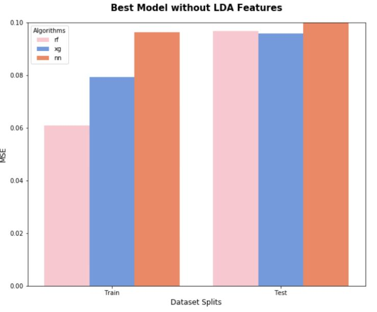
 
Although the test error of NN is slightly worse than that of RF, we thought RF performed much better since the train errors were much closer to the test errors, which meant the model was not overfitting. Like the models above, we decided to add more features from LDA in order to get better results.

**With text features **, we incorporated the 35 LDA features into the model using both Goodreads and Amazon metadata. The features significantly improved our model performance.
The graph below illustrates the different error metrics evaluated on 3 different algorithms for this model: RF, XGB, and NN. Among the metrics, XGB consistently has a lower test error rate than the other two as well as has the highest adjusted R2 value. On the other hand, NN always has the worst test errors and R2 values regardless of metrics. Therefore, XGB is the best algorithm for the model that uses Goodreads and Amazon features to predict rating differences. 

 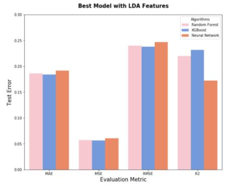

Despite being the best algorithm, XGB test error is still high.

Note that the MAE test error, for example, of XHB is about 0.1837, while the mean difference is 0.4 (based on EDA), this means that, on average, the error of the prediction could be as high as 45% for each prediction. Hence, it is not reliable enough for non-experimental settings.  

After knowing that XGB performed best, then followed by RF and NN, we tested out some weighted average ensembles and we came up with the best model with the formula:
** .30RF + .60XGB + .10NN ** which gives us the best error performance:

METRIC  |  TRAIN ERROR  |  TEST ERROR
---  |  ---  |  ---
MAE  |  0.1542  |  0.1834
MSE  |  0.0399  |  0.0562
RMSE  |  0.1998  |  0.2370
R2 Adj  |  0.4779  |  0.2353

Overall, all of our models outperformed the baseline, which is a good sign that we created a good prediction model. However, our two best models’ RMSE came out to be 0.2370 and 0.2109, which is quite high considering that the average rating difference between Goodreads and Amazon is about 0.4 (it is half of the average rating difference!).  

We also took into consideration that the possible range of rating differences is [-4,4], so our RMSE is only about 3% of the possible rating differences. Additionally, the actual range of our data is [-2.78,1.99], so our RMSE is about 5% of the actual rating differences. 5% coincidentally is the cut off point we decided was a “good enough” RMSE for our models, and our models made the cut. However, if given more time and resources, we would like to improve the models and bring the RMSE down to about 1% of the range of the rating differences.

